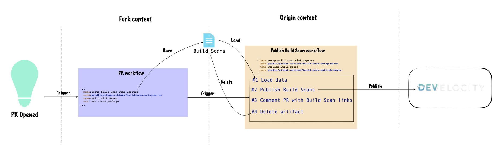
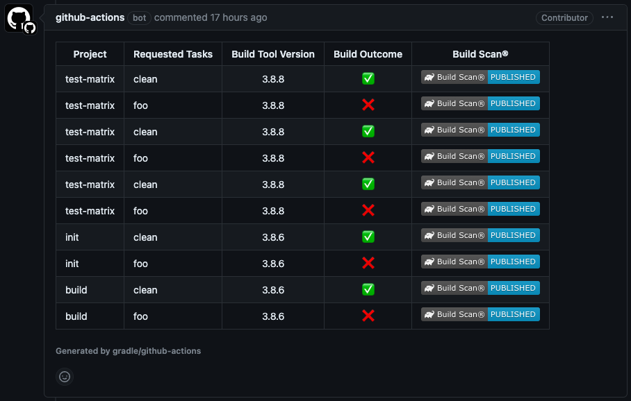
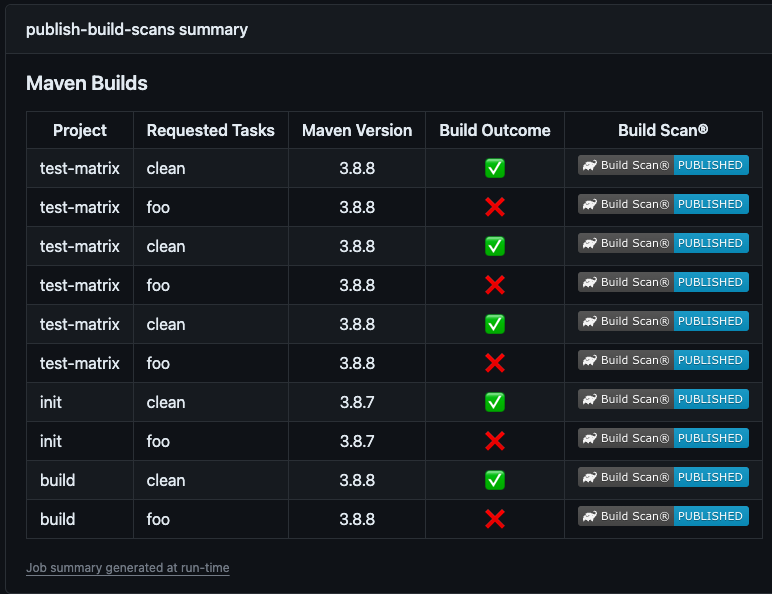

# github-actions

A collection of composite GitHub Actions

## Publish Build Scans® for pull-requests issued from forked repositories

### Description
When submitting a pull request, a GitHub workflow that validates the change is usually triggered, however the Develocity Build Scans® can’t be published 
as workflows from forked repositories do not have access to secrets although an access token is required to publish a Build Scan®

This repository contains some actions which can be combined to solve this.

_Note:_
The `Approve and Run` manual step documented [here](https://docs.github.com/en/actions/managing-workflow-runs/approving-workflow-runs-from-public-forks) must be enabled on the GitHub repository configuration to meet legal requirements (this is the default configuration).

### Maven workflow

#### Architecture


#### Usage

In the GitHub workflow called to validate a pull-request, insert the `Setup Build Scan dump capture` once in each job having steps invoking Maven.

```yaml
name: PR Build
jobs:
  build:  
      - name: Setup Maven Build Scan dump capture
        uses: gradle/github-actions/build-scan-setup-maven@v1-beta
      - name: Build with Maven
        run: ./mvnw clean package
[...]
```

Add a new GitHub workflow to publish the Build Scans® saved during the previous step

```yaml
name: Upload Build Scans

on:
  workflow_run:
    workflows: [ "PR Build" ]
    types: [ completed ]

jobs:

  publish-build-scans:
    runs-on: ubuntu-latest
    permissions:
      actions: write
      pull-requests: write
    steps:
      - name: Setup Build Scan link capture
        uses: gradle/github-actions/build-scan-setup-maven@v1-beta
      - name: Publish Build Scans
        uses: gradle/github-actions/build-scan-publish-maven@v1-beta
        with:
          develocity-url: 'https://<MY_DEVELOCITY_URL>'
          develocity-access-key: ${{ secrets.<DEVELOCITY_ACCESS_KEY> }}
```

_Note:_
Some parameters need to be adjusted here:
- The workflow name (here `PR Build`) triggered when a pull-request is submitted
- The Develocity URL (here `https://<MY_DEVELOCITY_URL>`)
- The secret name holding the Develocity access key (here `<DEVELOCITY_ACCESS_KEY>`)
- If using the [Maven wrapper](https://maven.apache.org/wrapper/), check the [relevant section](#usage-with-maven-wrapper)
 
#### Implementation details

##### build-scan-setup-maven

The action addresses two use cases:
- Save unpublished Build Scan® data as a workflow artifact with name `build-scan-data-maven`, which can then be published in a dependent workflow.
- Capture links of Build Scan® published to Develocity, which can then be displayed as a pull-request comment

The _capture strategy_ can be customized:
- `ALWAYS`: default behavior, capture will be attempted on each Maven invocation
- `ON_FAILURE`: capture will be attempted only on failed builds
- `ON_DEMAND`: capture will be attempted if `CAPTURE_BUILD_SCAN=true` in the environment

The _capture_ can be _enabled_/_disabled_ separately:
- `build-scan-capture-unpublished-enabled`: to disable unpublished Build Scan® capture
- `build-scan-capture-link-enabled`: to disable Build Scan® link capture

The process is handled by a [Maven extension](https://maven.apache.org/guides/mini/guide-using-extensions.html) `maven-build-scan-capture-extension.jar` which is running during each Maven invocation.
The extension must be registered at the beginning of the GitHub workflow job, by copying it in `$MAVEN_HOME/lib/ext/`.
The `MAVEN_HOME` environment variable is used if present, otherwise, the csv list of folders `maven-home-search-patterns` is searched. This variable van be configured.

`workflow-filename` and `job-filename` are only used in the summary rendered by the `maven-build-scan-publish` action. Default values can be overridden, which is highly recommended when using a [matrix strategy](https://docs.github.com/en/actions/using-jobs/using-a-matrix-for-your-jobs) as those values would collide on each matrix case. 

**Event Triggers**:

- `pull_request`: To capture unpublished Build Scan®
- `workflow_run`: To capture Build Scan® links

**Action inputs**:

| Name                                     | Description                                                                                                         | Default                                                                                                                                                                                                       |
|------------------------------------------|---------------------------------------------------------------------------------------------------------------------|---------------------------------------------------------------------------------------------------------------------------------------------------------------------------------------------------------------|
| `workflow-filename`                      | *Optional*: Name of the workflow triggering the build                                                               | `${{ github.workflow }}`                                                                                                                                                                                      |
| `job-filename`                           | *Optional*: Name of the job triggering the build                                                                    | `${{ github.job }}`                                                                                                                                                                                           |
| `maven-home-search-patterns`             | *Optional*: List of patterns to search for maven home (csv format)                                                  | `~/.m2/wrapper/dists/apache-maven-*/*/apache-maven-*/,/usr/share/apache-maven-*/,C:/Users/runneradmin/.m2/wrapper/dists/apache-maven-*/*/apache-maven-*/,C:/ProgramData/chocolatey/lib/maven/apache-maven-*/` |
| `build-scan-capture-strategy`            | *Optional*: Build Scan capture strategy (ALWAYS, ON_FAILURE, ON_DEMAND)                                             | `ALWAYS`                                                                                                                                                                                                      |
| `build-scan-capture-unpublished-enabled` | *Optional*: Flag to enable unpublished Build Scan capture                                                           | `true`                                                                                                                                                                                                        |
| `build-scan-capture-link-enabled`        | *Optional*: Flag to enable Build Scan link capture                                                                  | `true`                                                                                                                                                                                                        |
| `wrapper-init`                           | *Optional*: Flag to enable the Maven wrapper by running it (with `-version`) in order to trigger local installation | `false`                                                                                                                                                                                                       |
| `wrapper-path`                           | *Optional*: Path to mvnw script (used in combination with `wrapper-init`)                                           | ``                                                                                                                                                                                                            |

**Usage**:

Insert the `Setup Maven Build Scan dump capture` once in each job having steps invoking Maven.

```yaml
name: PR Build
jobs:
  [...]
  build:
    [...]
    - name: Setup Maven Build Scan dump capture
      uses: gradle/github-actions/build-scan-setup-maven@v1-beta
    - name: Build with Maven
      run: ./mvnw clean package
  [...]
```

##### Usage with Maven Wrapper

When using the Maven wrapper, the Maven extension can't be registered once at the beginning of the build by copying it to `$MAVEN_HOME/lib/ext` as the folder is created on first `mvnw` invocation (and emptied if already present).

There are three options in this situation (by order of preference):
1. Set `wrapper-init: true` to trigger the installation of Maven when running the `gradle/github-actions/build-scan-setup-maven` step
2. Register the Maven extension as a Maven CLI argument (`-Dmaven.ext.class.path`) 
3. Add a previous step calling `mvnw` and reference `gradle/github-actions/build-scan-setup-maven` step after

##### build-scan-publish-maven

The action will download any saved Build Scan® and publish them to Develocity.

The list of pull-request authors allowed to publish a Build Scan® can be specified by the csv parameter `authorized-list`. 
The action will publish Build Scans® if the initial pull-request author belongs to the list.

By default, the pull-request will be commented with a summary:



This comment will not be created if `skip-comment` is set to `true`, the summary details will in this case be accessible in `$RUNNER_TEMP/build-scan-data-maven/build-metadata.json` with the format below:

```json
{
  "prNumber": 42,
  "artifactId": 1080352553,
  "builds": [
    {
      "workflowName": "PR Build",
      "jobName": "test-matrix",
      "buildToolVersion": "3.8.8",
      "requestedTasks": "clean build",
      "buildId": "1701252758489-c27ff62b-3ab5-45f4-b7e4-2b362cf5220e",
      "buildFailure": false,
      "buildScanLink": "https://<DEVELOCITY_URL>/s/itg2ytkifb6wa"
    },
    {
      "workflowName": "PR Build",
      "jobName": "test-matrix",
      "buildToolVersion": "3.8.8",
      "requestedTasks": "install",
      "buildId": "1701252760831-89e3583d-3c3c-4a64-a958-e61aa791f4f4",
      "buildFailure": true,
      "buildScanLink": "https://<DEVELOCITY_URL>/s/dxqnlj5hgybq4"
    }
  ]
}
```
By default, a summary will be added to the GitHub workflow calling the action (can be skipped with `skip-summary` is set to `true`):




**Event Triggers**:

- `workflow_run`: to run after the build workflow. This event allows access to the repository secrets (_Develocity Access Key_) which is required to publish a Build Scan® to Develocity when authentication is enabled.

**Permissions**:

The following permissions are required for this action to operate:
- `pull-requests: write`: to comment the pull-request
- `actions: write`: to delete a workflow artifact

**Action inputs**:

| Name                         | Description                                                                  | Default                  |
|------------------------------|------------------------------------------------------------------------------|--------------------------|
| `develocity-url`             | Develocity URL                                                               |                          |
| `develocity-access-key`      | *Optional*: Develocity access key                                            |                          |
| `develocity-allow-untrusted` | *Optional*: Develocity allow-untrusted flag                                  | `false`                  |
| `skip-comment`               | *Optional*: Whether to comment or not the pull-request with Build Scan links | `false`                  |
| `skip-summary`               | *Optional*: Whether to add or not a summary to the GitHub workflow           | `false`                  |
| `authorized-list`            | *Optional*: CSV List of users allowed to publish Build Scans                 | `''`                     |
| `github-token`               | *Optional*: Github token                                                     | `${{ github.token }}`    |

**Usage**:

_Note:_
Some parameters need to be adjusted here:
- The workflow name (here `PR Build`) triggered when a pull-request is submitted
- The Develocity URL (here `https://<MY_DEVELOCITY_URL>`)
- The secret name holding the Develocity access key (here `<DEVELOCITY_ACCESS_KEY>`)

```yaml
name: Upload Build Scans

on:
  workflow_run:
    workflows: [ "PR Build" ]
    types: [ completed ]

jobs:

  publish-build-scans:
    runs-on: ubuntu-latest
    permissions:
      actions: write
      pull-requests: write
    steps:
      - name: Setup Maven Build Scan link capture
        uses: gradle/github-actions/build-scan-setup-maven@v1-beta
      - name: Publish Build Scans
        uses: gradle/github-actions/build-scan-publish-maven@v1-beta
        with:
          develocity-url: 'https://<MY_DEVELOCITY_URL>'
          develocity-access-key: ${{ secrets.<DEVELOCITY_ACCESS_KEY> }}
```
