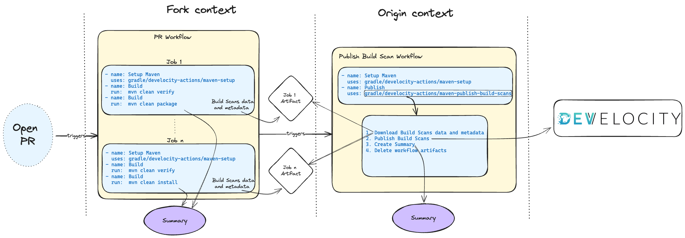

# develocity-actions

A collection of composite GitHub Actions related to [Develocity](https://gradle.com/)

## Add a workflow summary to Maven builds 

### Description
The `maven-setup` action adds a workflow summary for each Maven invocation.
The summary is also added as a pull-request comment in a pull-request context. This can be disabled via [configuration](#summary).

This action can be combined with the `maven-publish-build-scan` action to publish Build Scan® in a fork context. See [the relevant section](#publish-build-scans-for-pull-requests-issued-from-forked-repositories) for details.

### Usage

Insert the `Setup Maven` step once in each job having steps invoking Maven. Make sure to put the step before the Maven invocation.

```yaml
name: PR Build
jobs:
  build:  
      - name: Setup Maven
        uses: gradle/develocity-actions/maven-setup@v1
      - name: Build with Maven
        run: ./mvnw clean package
[...]
```

> [!NOTE]  
> When authenticated access is required to publish a Build Scan®, it is recommended to provide as input `develocity-access-key` to the `maven-setup` step. This triggers a request for a [short-lived access token](https://docs.gradle.com/develocity/api-manual/#short_lived_access_tokens) instead of relying on the `DEVELOCITY_ACCESS_KEY` environment variable.

If one wants to inject Develocity Maven Extension (and optionally CCUD Maven Extension), the `develocity-injection-enabled` input should be set to `true`. The `develocity-url`, `develocity-maven-extension-version`, and optionally `develocity-ccud-maven-extension-version` inputs should be set accordingly:
```yaml
name: PR Build
jobs:
  build:  
      - name: Setup Maven
        uses: gradle/develocity-actions/maven-setup@v1
        with:
          develocity-url: 'https://scans.gradle.com'
          develocity-injection-enabled: 'true'
          develocity-maven-extension-version: '1.21.6'
      - name: Build with Maven
        run: ./mvnw clean package
[...]
```

### Implementation details

The action enables two features:
- Display a summary of the Maven builds as a GitHub workflow summary or as a pull-request comment
- Capture unpublished Build Scan® data as a workflow artifact per job with prefix `build-scan-data-maven`, which can then be published in a dependent workflow.

#### Workflow Summary
By default, a summary will be added to the GitHub workflow calling the action (can be skipped if `add-job-summary` is set to `false`):


#### Pull-request Comment

By default, a comment will be added to the pull-request with the summary (can be skipped if `add-pr-comment` is set to `false`):


> [!NOTE]
> - The job name is computed by appending `github.job` to the current matrix value (if present) but can be overridden with `job-name` input.
> - The pull-request comment is overwriting the previous summary comment if present, this means that if several jobs have a setup-maven step, 
  only the last will have its summary commented in the PR. It is recommended to disable the pull-request summary in this case (`add-pr-comment: false`).  

#### Raw Summary data

Additionally, the summary details will be accessible in `$RUNNER_TEMP/build-scan-data-maven/build-metadata.json` with the format below:

```json
{
  "prNumber": 42,
  "buildToolType": "maven",
  "builds": [
    {
      "projectId": "maven-project",
      "workflowName": "PR Build",
      "jobName": "test-matrix",
      "buildToolVersion": "3.8.8",
      "requestedTasks": "clean build",
      "buildId": "1701252758489-c27ff62b-3ab5-45f4-b7e4-2b362cf5220e",
      "buildFailure": false,
      "buildTimestamp": "1701252760650",
      "buildScanLink": "https://<DEVELOCITY_URL>/s/itg2ytkifb6wa"
    },
    {
      "projectId": "maven-project",
      "workflowName": "PR Build",
      "jobName": "test-matrix",
      "buildToolVersion": "3.8.8",
      "requestedTasks": "install",
      "buildId": "1701252760831-89e3583d-3c3c-4a64-a958-e61aa791f4f4",
      "buildFailure": true,
      "buildTimestamp": "1701252760800",
      "buildScanLink": "https://<DEVELOCITY_URL>/s/dxqnlj5hgybq4"
    }
  ]
}
```
#### Capture unpublished Build Scan®

The _capture strategy_ can be customized:
- `ALWAYS`: default behavior, capture will be attempted on each Maven invocation
- `ON_FAILURE`: capture will be attempted only on failed builds
- `ON_DEMAND`: capture will be attempted if `CAPTURE_BUILD_SCAN=true` in the environment

The _capture_ can be _enabled_/_disabled_ separately:
- `capture-unpublished-build-scans`: to disable unpublished Build Scan® capture
- `capture-build-scan-links`: to disable Build Scan® link capture

The process is handled by a [Maven extension](https://maven.apache.org/guides/mini/guide-using-extensions.html) `maven-build-scan-capture-extension.jar` which is running during each Maven invocation.
The extension is automatically registered by configuring the environment `MAVEN_OPTS=-Dmaven.ext.classpath=<PATH_TO_EXTENSION>`.

> [!NOTE]
> If `MAVEN_OPTS` environment variable is set in the step invoking the `mvn` command, the extension won't be registered.
Make sure to use `MAVEN_OPTS: ${{ env.MAVEN_OPTS }} <EXTRA_PARAMETERS>` construction to append the extra parameters and have the extension registered.

The captured files are added as workflow artifact (one artifact per job).

When a Build Scan link is captured, it is added as output to the step invoking Maven.
The output name is `build-scan-url` and can be used in subsequent steps of the workflow.

**Event Triggers**:

- `pull_request`: To capture unpublished Build Scan®
- `workflow_run`: To capture Build Scan® links

**Permissions**:

The following permissions are required for this action to operate:
- `pull-requests: write`: to comment the pull-request

**Action inputs**:

| Name                                      | Description                                                                                       | Default  |
|-------------------------------------------|---------------------------------------------------------------------------------------------------|----------|
| `develocity-access-key`                   | *Optional*: Develocity access key. Should be set to a secret containing the Develocity Access key | ``       |
| `develocity-token-expiry`                 | *Optional*: Develocity short-lived access tokens expiry in hours                                  | `2`      |
| `capture-strategy`                        | *Optional*: Build Scan capture strategy (ALWAYS, ON_FAILURE, ON_DEMAND)                           | `ALWAYS` |
| `capture-unpublished-build-scans`         | *Optional*: Enable unpublished Build Scans capture                                                | `true`   |
| `capture-build-scan-links`                | *Optional*: Enable Build Scan links capture                                                       | `true`   |
| `job-name`                                | *Optional*: Job name (used in summary and as artifact suffix)                                     |          |
| `add-pr-comment`                          | *Optional*: Comment the pull-request with Build Scan links                                        | `true`   |
| `add-job-summary`                         | *Optional*: Add a summary to the GitHub workflow                                                  | `true`   |
| `add-project-id-in-job-summary`           | *Optional*: Add project id to the job summary / comment                                           | `false`  |  
| `develocity-injection-enabled`            | *Optional*: Whether to enable or not Develocity/CCUD Maven Extensions injection                   |          |  
| `develocity-url`                          | *Optional*: Develocity server URL                                                                 |          |  
| `develocity-maven-extension-version`      | *Optional*: Develocity Maven Extension version to be injected                                     |          |  
| `develocity-ccud-maven-extension-version` | *Optional*: Common Custom User Data Maven Extension version to be injected                        |          |  
| `develocity-allow-untrusted-server`       | *Optional*: Whether to allow communicating with untrusted server                                  |          |  

## Publish Build Scans® for pull-requests issued from forked repositories

### Description
When submitting a pull request from a forked GitHub repository, a GitHub workflow that validates the change cannot publish a Build Scan® 
as workflows from forked repositories do not have access to secrets. An access token is required to publish a Build Scan®.

> [!NOTE]
> The `Approve and Run` manual step documented [here](https://docs.github.com/en/actions/managing-workflow-runs/approving-workflow-runs-from-public-forks) must be enabled on the GitHub repository configuration to meet legal requirements (this is the default configuration).

### Maven workflow

#### Architecture


#### Usage

In the GitHub workflow called to validate a pull-request, insert the `Setup Maven` step once in each job having steps invoking Maven.

```yaml
name: PR Build
jobs:
  build:  
      - name: Setup Maven
        uses: gradle/develocity-actions/maven-setup@v1
      - name: Build with Maven
        run: ./mvnw clean package
[...]
```

Add a new GitHub workflow to publish the Build Scans® saved during the previous step

```yaml
name: Upload Build Scans

on:
  workflow_run:
    workflows: [ "PR Build" ]
    types: [ completed ]

jobs:

  publish-build-scans:
    runs-on: ubuntu-latest
    permissions:
      actions: write
      pull-requests: write
    steps:
      - name: Setup Build Scan link capture
        uses: gradle/develocity-actions/maven-setup@v1
      - name: Publish Build Scans
        uses: gradle/develocity-actions/maven-publish-build-scan@v1
        with:
          develocity-url: 'https://<MY_DEVELOCITY_URL>'
          develocity-access-key: ${{ secrets.<DEVELOCITY_ACCESS_KEY> }}
```

> [!NOTE]
> Some parameters need to be adjusted here:
> - The workflow name (here `PR Build`) triggered when a pull-request is submitted
> - The Develocity URL (here `https://<MY_DEVELOCITY_URL>`)
> - The secret name holding the Develocity access key (here `<DEVELOCITY_ACCESS_KEY>`)
 
#### Implementation details

The action will download any saved Build Scan® and publish them to Develocity.

The list of pull-request authors allowed to publish a Build Scan® can be specified by the csv parameter `authorized-users-list`. 
The action will publish Build Scans® if the initial pull-request author belongs to the list or if the list is empty.

**Event Triggers**:

- `workflow_run`: to run after the build workflow. This event allows access to the repository secrets (_Develocity Access Key_) which is required to publish a Build Scan® to Develocity when authentication is enabled.

**Permissions**:

The following permissions are required for this action to operate:
- `actions: write`: to delete a workflow artifact

**Action inputs**:

| Name                             | Description                                                                  | Default               |
|----------------------------------|------------------------------------------------------------------------------|-----------------------|
| `develocity-url`                 | Develocity URL                                                               |                       |
| `develocity-access-key`          | *Optional*: Develocity access key                                            |                       |
| `develocity-allow-untrusted`     | *Optional*: Develocity allow-untrusted flag                                  | `false`               |
| `authorized-users-list`          | *Optional*: CSV List of users allowed to publish Build Scans                 | `''`                  |
| `github-token`                   | *Optional*: Github token                                                     | `${{ github.token }}` |
