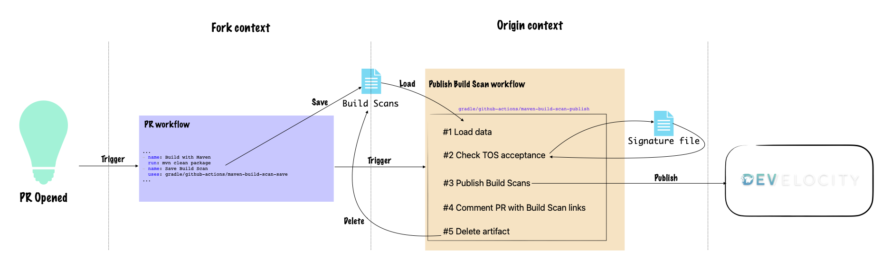

# github-actions

A collection of composite Github Actions

## Publish Build Scans® from forked repositories

### Description
When submitting a pull request, a Github workflow that validates the change is usually triggered, however the Develocity Build Scans® can’t be published for 2 reasons:
- The Develocity Terms of Service have not been agreed to by the contributor
- Workflows from forked repositories do not have access to secrets although an access token is required to publish a Build Scan®

This repository contains some actions which can be combined together to solve this.

### Architecture


### Usage

**Usage**:

Insert the `Save Build Scan` step after each Maven execution step in the Github workflow called to validate a pull-request (`Build with Maven` here).

```yaml
[...]
      - name: Build with Maven
        run: mvn clean package
      - name: Save Build Scan
        uses: gradle/github-actions/maven-build-scan/save@v1.0
[...]
```

Add a workflow to publish the Build Scans® saved during the previous step

_Note:_
Some parameters need to be adjusted here:
- The workflow name (here `Build`) triggered when a pull-request is submitted
- The build workflow filename (here `build.yml`) has to be adjusted to the filename of the workflow using `maven-build-scan/save`
- The location of the Develocity Terms of Service (here `https://foo.bar/tos.html`)
- The Develocity URL (here `https://<MY_DEVELOCITY_URL>`)
- The secret name holding the Develocity access key (here `<DEVELOCITY_ACCESS_KEY>`)

```yaml
name: Upload Build Scans

on:
  workflow_run:
    workflows: [ "Build" ]
    types: [ completed ]
  issue_comment:
    types: [ created ]

jobs:

  publish-build-scans:
    runs-on: ubuntu-latest
    permissions:
      contents: write
      pull-requests: write
    steps:
      - name: Publish Build Scan
        uses: gradle/github-actions/maven-build-scan@v1.0
        with:
          build-workflow-filename: 'build.yml'
          tos-location: 'https://foo.bar/tos.html'
          develocity-url: 'https://<MY_DEVELOCITY_URL>'
          develocity-access-key: ${{ secrets.<DEVELOCITY_ACCESS_KEY> }}
```

### Implementation details

#### maven-build-scan

This composite action is a meta action to simplify the logic on consumer side.

The action will download any saved Build Scan® and publish them to Develocity after having checked that the Terms of Service were accepted.

**Dependencies**:

- `maven-build-scan/load`
- `terms-of-service-acceptance/run`
- `maven-build-scan/publish`

**Event Triggers**:

This action should be configured to respond to the following event triggers:
- `workflow_run`: to check if the user has previously accepted the Terms of Service before publishing a Build Scan®.
- `issue_comment`: to check if any new pull-request comment is accepting the Terms of Service.
These event allows access to the repository secrets (_Develocity Access Key_) which is required to publish a Build Scan® to Gradle Enterprise when authentication is enabled.

**Permissions**:

The following permissions are required for this action to operate:
- `contents: write`: to create/edit the signature file
- `pull-requests: write`: to comment the pull-request

**Action inputs**:

| Name                                     | Description                                                                                    | Default                                                                                                                                                      |
|------------------------------------------|------------------------------------------------------------------------------------------------|--------------------------------------------------------------------------------------------------------------------------------------------------------------|
| `build-workflow-filename`                | Filename of the workflow using `maven-build-scan/save` (called upon pull-request submission)   |                                                                                                                                                              |
| `tos-location`                           | Terms Of Service location (URL)                                                                |                                                                                                                                                              |
| `develocity-url`                         | Develocity URL                                                                                 |                                                                                                                                                              |
| `develocity-access-key`                  | *Optional*: Develocity access key                                                              |                                                                                                                                                              |
| `develocity-allow-untrusted`             | *Optional*: Develocity allow-untrusted flag                                                    | `false`                                                                                                                                                      |
| `signature-branch`                       | *Optional*: Git branch where the signature file will be stored                                 | `${{ github.event.repository.default_branch }}`                                                                                                              |
| `signature-location`                     | *Optional*: Signature file location                                                            | `.github/develocity-tos.json`                                                                                                                                |
| `pr-comment-tos-acceptance-missing`      | *Optional*: pull-request comment added when Terms of Service have not previously been accepted | `Please accept [Develocity Terms Of Service]({0}) to get your pull-request Build Scan published by commenting this pull-request with the following message:` |
| `pr-comment-tos-acceptance-request`      | *Optional*: pull-request comment to accept the Terms of Service                                | `I have read Develocity Terms Of Service and I hereby accept the Terms`                                                                                      |
| `pr-comment-tos-acceptance-confirmation` | *Optional*: pull-request comment added when Terms of Service are accepted                      | `All Contributors have accepted Develocity Terms Of Service.`                                                                                                |
| `white-list`                             | *Optional*: CSV List of users not required to accept the Terms of Service                      | `''`                                                                                                                                                         |
| `github-token`                           | *Optional*: Github token                                                                       | `${{ github.token }}`                                                                                                                                        |

**Usage**:

_Note:_
Some parameters need to be adjusted here:
- The build workflow filename (here `build.yml`) has to be adjusted to the filename of the workflow using `maven-build-scan/save`
- The location of the Develocity Terms of Service (here `https://foo.bar/tos.html`)
- The Develocity URL (here `https://<MY_DEVELOCITY_URL>`)
- The secret name holding the Develocity access key (here `<DEVELOCITY_ACCESS_KEY>`)

```yaml
      - name: Publish Build Scan
        uses: gradle/github-actions/maven-build-scan@v1.0
        with:
          build-workflow-filename: 'build.yml'
          tos-location: 'https://foo.bar/tos.html'
          develocity-url: 'https://<MY_DEVELOCITY_URL>'
          develocity-access-key: ${{ secrets.<DEVELOCITY_ACCESS_KEY> }}
```

#### maven-build-scan/save
A Composite action to save an unpublished Maven Build Scan®.

The action saves unpublished Build Scan® data as a workflow artifact with name `maven-build-scan-data`, which can then be published in a dependent workflow.

Use this action in your existing pull-request workflows to allow Build Scan® to be published. Since these workflows are running in an untrusted context, they do not have access to the required secrets to publish the Build Scan® directly.

Since the Develocity Maven Extension only saves the Build Scan® data for the most recent Maven execution, a step using this action must be inserted after each Maven execution step in the workflow.

**Dependencies**:

- [actions/upload-artifact](https://github.com/marketplace/actions/upload-a-build-artifact)

**Event Triggers**:

This composite action can be called from any workflow but the main use case is to save unpublished Build Scan® issued from workflows triggered on `pull_request` event

**Action inputs**:

N/A

**Usage**:

Insert the `Save Build Scan` step after each Maven execution step in the Github workflow called to validate a pull-request (`Build with Maven` here).

```yaml
[...]
      - name: Build with Maven
        run: mvn clean package
      - name: Save Build Scan
        uses: gradle/github-actions/maven-build-scan/save@v1.0
[...]
```

#### maven-build-scan/load
A Composite action to load artifacts saved by `maven-build-scan/save`.

Use this action in a separate workflow to prepare the Build Scan® publication.

**Dependencies**:

- [dawidd6/action-download-artifact](https://github.com/marketplace/actions/download-workflow-artifact)

**Event Triggers**:

This action should be configured to respond to the following event trigger (see `maven-build-scan/publish` for more details):
- `workflow_run`: to run after the pull-request workflow.
- `issue_comment`: to run after the pull-request is commented.

The action fails for any other event trigger, or if the comment is different than `recheck` or `I have read Develocity Terms Of Service and I hereby accept the Terms` (can be overridden).

**Action inputs**:

| Name                                | Description                                                                                  | Default |
|-------------------------------------|----------------------------------------------------------------------------------------------|---------|
| `build-workflow-filename`           | Filename of the workflow using `maven-build-scan/save` (called upon pull-request submission) |         |
| `pr-comment-tos-acceptance-request` | pull-request comment to accept the Terms of Service                                          |         |

**Action outputs**:

| Name         | Description                                                  |
|--------------|--------------------------------------------------------------|
| `pr-number`  | pull-request number saved by `maven-build-scan/save` action  |

**Usage**:

_Note:_
Some parameters need to be adjusted here:
- The build workflow filename (here `build.yml`) has to be adjusted to the filename of the workflow using `maven-build-scan/save`

```yaml
[...]
      - name: Load Build Scan data
        id: load
        uses: gradle/github-actions/maven-build-scan/load@v1.0
        with:
          build-workflow-filename: 'build.yml'
[...]
```

#### terms-of-service-acceptance/run

A composite action to verify that Develocity Terms of Service have been accepted.

This action checks if the user submitting a pull-request has accepted the Terms of Service.
If the user has previously accepted the terms, then the action succeeds.
If not, a comment is made on the pull-request asking the user to accept and the action fails. The user can then accept the Terms of Service by responding with a specific comment on the pull-request.

See the [cla-assistant-lite documentation](https://github.com/marketplace/actions/cla-assistant-lite) for more details.

**Dependencies**:

- [cla-assistant-lite](https://github.com/marketplace/actions/cla-assistant-lite)

**Event Triggers**:

This action should be configured to respond to the following event triggers:
- `workflow_run`: to check if the user has previously accepted the Terms of Service before publishing a Build Scan®.
- `issue_comment`: to check if any new pull-request comment is accepting the Terms of Service.

**Permissions**:

The following permissions are required for this action to operate:
- `contents: write`: to create/edit the signature file
- `pull-requests: write`: to comment the pull-request

**Action inputs**:

| Name                                     | Description                                                                        | Default |
|------------------------------------------|------------------------------------------------------------------------------------|---------|
| `tos-location`                           | Terms Of Service location (URL)                                                    |         |
| `pr-number`                              | pull-request number                                                                |         |
| `signature-branch`                       | Git branch where the signature file will be stored                                 |         |
| `signature-location`                     | Signature file location                                                            |         |
| `pr-comment-tos-acceptance-missing`      | pull-request comment added when Terms of Service have not previously been accepted |         |
| `pr-comment-tos-acceptance-request`      | pull-request comment to accept the Terms of Service                                |         |
| `pr-comment-tos-acceptance-confirmation` | pull-request comment added when Terms of Service are accepted                      |         |
| `white-list`                             | CSV List of users not required to accept the Terms of Service                      |         |
| `github-token`                           | Github token                                                                       |         |

**Usage**:

_Note:_
Some parameters need to be adjusted here:
- The pull-request number (here `steps.load.outputs.pr-number`) has to be adjusted to the value set in the context

```yaml
[...]
      - name: Verify Terms of Service acceptance
        uses: gradle/github-actions/terms-of-service-acceptance/run@v1.0
        with:
          tos-location: 'https://foo.bar/tos.html'
          pr-number: ${{ steps.load.outputs.pr-number }}
[...]
```

#### maven-build-scan/publish

This action will publish all Maven Build Scans® that have been saved as workflow artifacts by the `maven-build-scan/save` action.

Use this action in a separate workflow with:
- a `workflow_run` event trigger, that will run after an existing pull-request workflow has completed. 
- a `issue_comment` event trigger, that will run after a comment accepting the Terms of Service is added to the pull-request
These event allows access to the repository secrets (_Develocity Access Key_) which is required to publish a Build Scan® to Gradle Enterprise when authentication is enabled.

The action will download any saved Build Scan® and publish them to Develocity.

The Build Scan® publication requires the Gradle Terms of Service to be accepted, this can be achieved by adding a previous step using the `terms-of-service-acceptance/run` action.

**Dependencies**:

N/A

**Event Triggers**:

This action should be configured to respond to the following event trigger:
- `workflow_run`: to run after the pull-request workflow.
- `issue_comment`: to run after the pull-request is commented.

**Permissions**:

The following permissions are required for this action to operate:
- `pull-requests: write`: to comment the pull-request

**Action inputs**:

| Name                           | Description                        | Default               |
|--------------------------------|------------------------------------|-----------------------|
| `develocity-url`               | Develocity URL                     |                       |
| `pr-number`                    | pull-request number                |                       |
| `develocity-allow-untrusted`   | Develocity allow-untrusted flag    |                       |
| `develocity-access-key`        | *Optional*: Develocity access key  |                       |
| `github-token`                 | *Optional*: Github token           | `${{ github.token }}` |

**Usage**:

_Note:_
Some parameters need to be adjusted here:
- The Develocity URL (here `https://<MY_DEVELOCITY_URL>`)
- The secret name holding the Develocity access key (here `<DEVELOCITY_ACCESS_KEY>`)

```yaml
[...]
      - name: Publish Maven Build Scans
        uses: gradle/github-actions/maven-build-scan/publish@v1.0
        with:
          develocity-url: 'https://<MY_DEVELOCITY_URL>'
          develocity-access-key: ${{ secrets.<DEVELOCITY_ACCESS_KEY> }}
          pr-number: ${{ steps.load.outputs.pr-number }}
[...]
```
