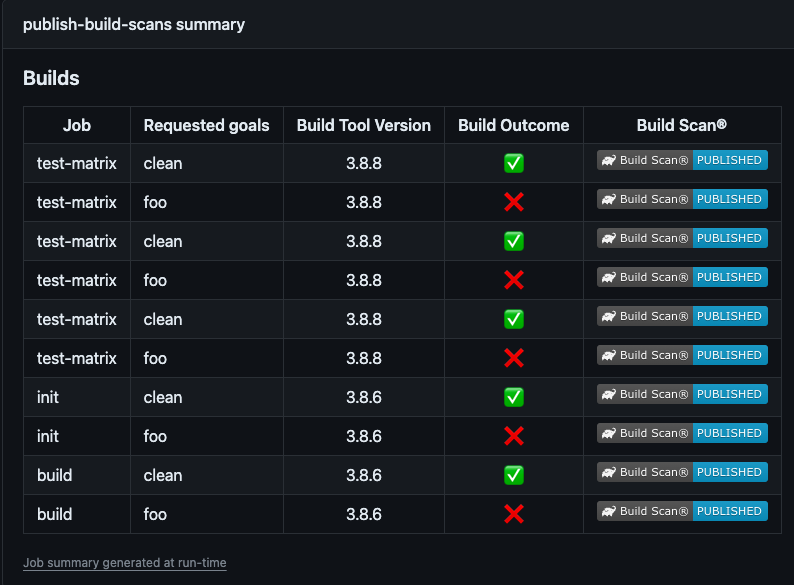

# github-actions

A collection of composite GitHub Actions

## Publish Build Scans® for pull-requests issued from forked repositories

### Description
When submitting a pull request, a GitHub workflow that validates the change is usually triggered, however the Develocity Build Scans® can’t be published 
as workflows from forked repositories do not have access to secrets although an access token is required to publish a Build Scan®

This repository contains some actions which can be combined to solve this.

_Note:_<br>
The `Approve and Run` manual step documented [here](https://docs.github.com/en/actions/managing-workflow-runs/approving-workflow-runs-from-public-forks) must be enabled on the GitHub repository configuration to meet legal requirements (this is the default configuration).

### Maven workflow

#### Architecture


#### Usage

In the GitHub workflow called to validate a pull-request, insert the `Setup Build Scan dump capture` step once in each job having steps invoking Maven.

```yaml
name: PR Build
jobs:
  build:  
      - name: Setup Build Scan dump capture
        uses: gradle/github-actions/maven-setup@v1
      - name: Build with Maven
        run: ./mvnw clean package
[...]
```

Add a new GitHub workflow to publish the Build Scans® saved during the previous step

```yaml
name: Upload Build Scans

on:
  workflow_run:
    workflows: [ "PR Build" ]
    types: [ completed ]

jobs:

  publish-build-scans:
    runs-on: ubuntu-latest
    permissions:
      actions: write
      pull-requests: write
    steps:
      - name: Setup Build Scan link capture
        uses: gradle/github-actions/maven-setup@v1
      - name: Publish Build Scans
        uses: gradle/github-actions/maven-publish-build-scan@v1
        with:
          develocity-url: 'https://<MY_DEVELOCITY_URL>'
          develocity-access-key: ${{ secrets.<DEVELOCITY_ACCESS_KEY> }}
```

_Note:_<br>
Some parameters need to be adjusted here:
- The workflow name (here `PR Build`) triggered when a pull-request is submitted
- The Develocity URL (here `https://<MY_DEVELOCITY_URL>`)
- The secret name holding the Develocity access key (here `<DEVELOCITY_ACCESS_KEY>`)
 
#### Implementation details

##### maven-setup

The action addresses two use cases:
- Save unpublished Build Scan® data as a workflow artifact per job with prefix `build-scan-data-maven`, which can then be published in a dependent workflow.
- Capture links of Build Scan® published to Develocity, which can then be displayed as a pull-request comment

The _capture strategy_ can be customized:
- `ALWAYS`: default behavior, capture will be attempted on each Maven invocation
- `ON_FAILURE`: capture will be attempted only on failed builds
- `ON_DEMAND`: capture will be attempted if `CAPTURE_BUILD_SCAN=true` in the environment

The _capture_ can be _enabled_/_disabled_ separately:
- `capture-unpublished-build-scans`: to disable unpublished Build Scan® capture
- `capture-build-scan-links`: to disable Build Scan® link capture

The process is handled by a [Maven extension](https://maven.apache.org/guides/mini/guide-using-extensions.html) `maven-build-scan-capture-extension.jar` which is running during each Maven invocation.
The extension is automatically registered by configuring the environment `MAVEN_OPTS=-Dmaven.ext.classpath=<PATH_TO_EXTENSION>`.

_Note:_<br>
If `MAVEN_OPTS` environment variable is set in the step invoking the `mvn` command, the extension won't be registered. 
Make sure to use `MAVEN_OPTS: ${{ env.MAVEN_OPTS }} <EXTRA_PARAMETERS>` construction to append the extra parameters and have the extension registered.

The job name is used in the summary and as artifact suffix, by default its value is computed by appending `github.job` to the current matrix value (if present) but can be overridden with `job-name` input.

**Event Triggers**:

- `pull_request`: To capture unpublished Build Scan®
- `workflow_run`: To capture Build Scan® links

**Action inputs**:

| Name                              | Description                                                             | Default  |
|-----------------------------------|-------------------------------------------------------------------------|----------|
| `capture-strategy`                | *Optional*: Build Scan capture strategy (ALWAYS, ON_FAILURE, ON_DEMAND) | `ALWAYS` |
| `capture-unpublished-build-scans` | *Optional*: Whether to enable or not unpublished Build Scans capture    | `true`   |
| `capture-build-scan-links`        | *Optional*: Whether to enable or not Build Scan links capture           | `true`   |
| `job-name`                        | *Optional*: Job name (used in summary and as artifact suffix)           |          |

**Usage**:

Insert the `Setup Build Scan dump capture` once in each job having steps invoking Maven.

```yaml
name: PR Build
jobs:
  [...]
  build:
    [...]
    - name: Setup Build Scan dump capture
      uses: gradle/github-actions/maven-setup@v1
    - name: Build with Maven
      run: ./mvnw clean package
  [...]
```

##### maven-publish-build-scan

The action will download any saved Build Scan® and publish them to Develocity.

The list of pull-request authors allowed to publish a Build Scan® can be specified by the csv parameter `authorized-users-list`. 
The action will publish Build Scans® if the initial pull-request author belongs to the list.

By default, the pull-request will be commented with a summary (can be skipped if `skip-pr-comment` is set to `true`):


The summary details will be accessible in `$RUNNER_TEMP/build-scan-data-maven/build-metadata.json` with the format below:

```json
{
  "prNumber": 42,
  "artifactId": 1080352553,
  "builds": [
    {
      "projectId": "maven-project",
      "workflowName": "PR Build",
      "jobName": "test-matrix",
      "buildToolVersion": "3.8.8",
      "requestedTasks": "clean build",
      "buildId": "1701252758489-c27ff62b-3ab5-45f4-b7e4-2b362cf5220e",
      "buildFailure": false,
      "buildScanLink": "https://<DEVELOCITY_URL>/s/itg2ytkifb6wa"
    },
    {
      "projectId": "maven-project",
      "workflowName": "PR Build",
      "jobName": "test-matrix",
      "buildToolVersion": "3.8.8",
      "requestedTasks": "install",
      "buildId": "1701252760831-89e3583d-3c3c-4a64-a958-e61aa791f4f4",
      "buildFailure": true,
      "buildScanLink": "https://<DEVELOCITY_URL>/s/dxqnlj5hgybq4"
    }
  ]
}
```
By default, a summary will be added to the GitHub workflow calling the action (can be skipped with `skip-job-summary` is set to `true`):




**Event Triggers**:

- `workflow_run`: to run after the build workflow. This event allows access to the repository secrets (_Develocity Access Key_) which is required to publish a Build Scan® to Develocity when authentication is enabled.

**Permissions**:

The following permissions are required for this action to operate:
- `pull-requests: write`: to comment the pull-request
- `actions: write`: to delete a workflow artifact

**Action inputs**:

| Name                             | Description                                                                  | Default               |
|----------------------------------|------------------------------------------------------------------------------|-----------------------|
| `develocity-url`                 | Develocity URL                                                               |                       |
| `develocity-access-key`          | *Optional*: Develocity access key                                            |                       |
| `develocity-allow-untrusted`     | *Optional*: Develocity allow-untrusted flag                                  | `false`               |
| `skip-pr-comment`                | *Optional*: Whether to comment or not the pull-request with Build Scan links | `false`               |
| `skip-job-summary`               | *Optional*: Whether to add or not a summary to the GitHub workflow           | `false`               |
| `skip-project-id-in-job-summary` | *Optional*: Whether to add or not project id to the job summary / comment    | `true`                |  
| `authorized-users-list`          | *Optional*: CSV List of users allowed to publish Build Scans                 | `''`                  |
| `github-token`                   | *Optional*: Github token                                                     | `${{ github.token }}` |

**Usage**:

_Note:_<br>
Some parameters need to be adjusted here:
- The workflow name (here `PR Build`) triggered when a pull-request is submitted
- The Develocity URL (here `https://<MY_DEVELOCITY_URL>`)
- The secret name holding the Develocity access key (here `<DEVELOCITY_ACCESS_KEY>`)

```yaml
name: Upload Build Scans

on:
  workflow_run:
    workflows: [ "PR Build" ]
    types: [ completed ]

jobs:

  publish-build-scans:
    runs-on: ubuntu-latest
    permissions:
      actions: write
      pull-requests: write
    steps:
      - name: Setup Build Scan link capture
        uses: gradle/github-actions/maven-setup@v1
      - name: Publish Build Scans
        uses: gradle/github-actions/maven-publish-build-scan@v1
        with:
          develocity-url: 'https://<MY_DEVELOCITY_URL>'
          develocity-access-key: ${{ secrets.<DEVELOCITY_ACCESS_KEY> }}
```
